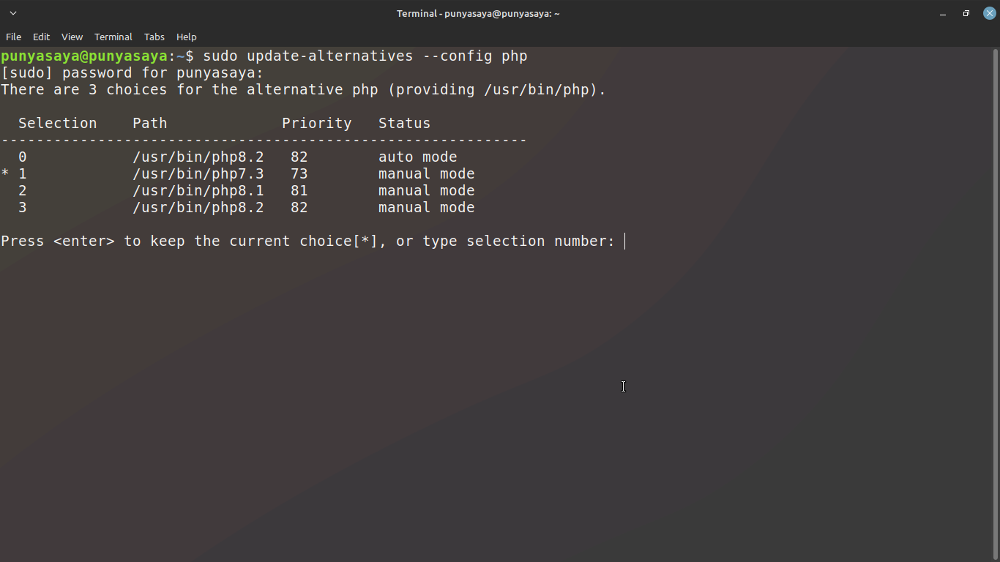

# MENU
- [Ganti Versi PHP](#ganti-versi-php)
- [Import File SQL berukuran besar](#import-file-sql-berukuran-besar)
---

## Ganti Versi PHP 
1.  Buka Terminal dan ketik
    ```sh
    sudo update-alternatives --config php
    ```
2. Akan Muncul list seperti ini. lalu pilih saja sesuai nomer nya
    
3. Restart server Apache
    ```sh
    sudo systemctl restart apache2
    ```
Referensi :
- *[https://sangcahaya.id/cara-mengganti-versi-php-pada-os-ubuntu-yang-sudah-terpasang-multi-php-version/](https://sangcahaya.id/cara-mengganti-versi-php-pada-os-ubuntu-yang-sudah-terpasang-multi-php-version/)*

## Import File SQL berukuran besar
1. Masuk ke MYSQL lewat Terminal
    ```sh
    mysql -u usernamenya -p
    ```
    Atau :
    ```sh
    sudo mysql
    ```
2. Pilih Database
    ```sql
    USE nama_database;
    ```
3. Lalu Ketik
    ```sql
    set global net_buffer_length=1000000;
    set global max_allowed_packet=1000000000;
    SET foreign_key_checks = 0;
    SET UNIQUE_CHECKS = 0;
    SET AUTOCOMMIT = 0;
    ```
4. Lalu pilih file *.sql yang akan diimport
    ```sql
    source path/nama_file.sql
    ```
    Contoh : 
    ```sql
    source /home/punyasaya/Downloads/nama_file.sql
    ```
5. Kalau sudah, kembalikan lagi setingan ke awal
    ```sql
    SET foreign_key_checks = 1;
    SET UNIQUE_CHECKS = 1;
    SET AUTOCOMMIT = 1;
    ```
Referensi:
- *[https://agungprasetyo.net/tips-n-trick/import-file-sql-berukuran-besar-ke-database-mysql-dari-command-line/](https://agungprasetyo.net/tips-n-trick/import-file-sql-berukuran-besar-ke-database-mysql-dari-command-line/)